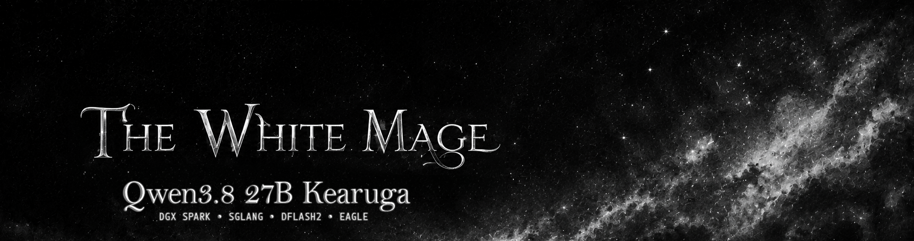

# 🧙‍♂️ Qwen3.8-27B Kearuga on a Single DGX Spark

<p align="center">
  <br><a href="CHANGELOG.md"></a> <a href="https://huggingface.co/0xWhiteMage/Qwen3.8-27B-Kearuga"></a> <a href="https://huggingface.co/z-lab/Qwen3.8-27B-DFlash2"></a> <a href="LICENSE"></a> <a href="https://x.com/0xWhiteMage" target="_blank"></a> <a href="https://ko-fi.com/0xwhitemage" target="_blank"></a>
</p>

Serve **[Qwen3.8-27B-Kearuga](https://huggingface.co/0xWhiteMage/Qwen3.8-27B-Kearuga)** paired with the stock **[z-lab/Qwen3.8-27B-DFlash2](https://huggingface.co/z-lab/Qwen3.8-27B-DFlash2)** drafter on **[SGLang](https://docs.sglang.io)** on a single 128 GB NVIDIA DGX Spark (GB10 / SM121). 

This repository provides certified production container launchers, hardware configurations, priority preemption queues, and automated multi-gate verification suites.

* ⚡ **DFlash 2 (Interactive Daily Driver)**: Ultra-responsive C1–C4 profile (57 tok/s C1 decode, 94 tok/s aggregate C4, 264 ms TTFT) with full reasoning & tool-calling support.
* 📜 **1M-Token KV Pool**: Sustains **4 simultaneous native 262K contexts** in shared unified memory without swapping or fragmentation.
* 🛡️ **Tiered Sensitivity Hierarchy**: EXL3-inspired mixed-precision (GPTQ-4o6 / NVFP4 AWQ / FP8 / BF16) preserving vocabulary logit tails and intermediate draft taps.
* ⏱️ **Priority Queue Preemption**: Sub-3-second interactive response under full multi-session saturation via native priority scheduling.
* 🚀 **Official Image, Zero Overlays**: Boots cleanly on official digest-pinned SGLang releases without custom Docker builds or kernel patches.

> 📖 **Deep Architectural Rationale**: Read **[Kearuga: Architecture Insights & Design Rationale](INSIGHTS.md)** for an in-depth analysis of our tiered quantization map, Four-Over-Six group scaling, and DFlash 2 block-diffusion serving.
>
> 🤗 **Model Checkpoint**: The production target weights are hosted on Hugging Face at **[0xWhiteMage/Qwen3.8-27B-Kearuga](https://huggingface.co/0xWhiteMage/Qwen3.8-27B-Kearuga)** (24.85 GB, 3 shards + MTP head).

---

## 📢 Recent Updates

See the complete chronological release history in **[CHANGELOG.md](CHANGELOG.md)**.

### 🌟 v0.5.0 Release Highlights
* 🎯 **New Production Checkpoint ([Qwen3.8-27B-Kearuga](https://huggingface.co/0xWhiteMage/Qwen3.8-27B-Kearuga))**: Upgraded to a hybrid GPTQ-4o6 + FP8 + NVFP4 architecture that cuts served first-token KL divergence in half (0.0334 → 0.0165) vs. legacy NVFP4 builds, with 40/40 top-1 agreement and a 24.85 GB footprint.
* ⚡ **Official SGLang Image Migration**: Switched to `lmsysorg/sglang@sha256:616a3e97…` — with upstream integration of DFlash 2 PRs (`sglang#35371, #35496`), external kernel overlays are no longer required. Time-To-First-Token (TTFT) improved by −6%.
* 🎛️ **Sweep-Validated K=10 Draft Block**: K=10 demonstrated Pareto optimality across all test domains (K=8 loses 7–12% code/math acceptance; K=12/16 degrade prose/IFEval and C4 throughput).
* 🧊 **BF16 KV Cache by Default**: Preserves maximum logit fidelity (KL: 0.0170 → 0.0165, exact 32-token continuations: 20/40 vs 19/40) with negligible compute overhead.

---

## 📊 Benchmarks & Community Comparison

> 🚧 **Active Drafter Development**: An upgraded, on-target trained DFlash 2 drafter is currently under development. The interactive benchmarks below reflect the current stock `z-lab/Qwen3.8-27B-DFlash2` drafter; updated performance will be published upon release.

> *"DFlash 2 delivers instant interactive feedback (57 tok/s C1 decode, 264 ms TTFT) with four simultaneous native 262K contexts in shared unified memory."*

### ⚡ 1. Interactive Throughput & Community Comparison (C1–C4)
*Measured on NVIDIA DGX Spark (GB10 / SM121), Temperature 0, reasoning enabled.*

| Solution / Repository | Speculative Method | Dedicated C1 (tok/s) | Net Decode C1 (tok/s) | Saturated C4 (tok/s) | Ladder C8 (tok/s) |
|---|---|---:|---:|---:|---:|
| 🧙‍♂️ **Kearuga Model Suite** | **DFlash 2 (BF16)** | **57.0** | **57.0** | **94.0** | — |
| 🔹 [MiaAI-Lab (DFlash 2)](https://github.com/MiaAI-Lab/Qwen3.8-27B-SGLang-DGX-Spark) | DFlash 2 / DSpark | ~50.9–51.5 | ~29.0–35.0 | 111.60 | — |
| 🔹 [MiaAI-Lab (MTP)](https://github.com/MiaAI-Lab/Qwen3.8-27B-SGLang-DGX-Spark) | MTP (In-Checkpoint) | ~26.0 | 33.0–35.0 | ~95.0 | — |
| 🔹 [Weschera (Speed Profile)](https://github.com/Weschera/Qwen3.8-27B-NVFP4-DFlash2-DGX-Spark) | DFlash 2 (Block 10) | 42.04 | — | 66.31 | 114.50 |
| 🔹 [Weschera (Capacity Profile)](https://github.com/Weschera/Qwen3.8-27B-NVFP4-DFlash2-DGX-Spark) | DFlash 2 (Block 8) | 34.08 | 25.33 | 64.10 | 120.58 |
| 🔹 [r0b0tlab](https://github.com/r0b0tlab/qwen38-27b-nvfp4-sm121-sglang) | SM121 Pin (DFlash 2 K8) | 28.38 | 23.47 | 54.99 | 92.05 |

*Note: Measured with stock DFlash 2 and 2048 draft window on DGX Spark: C1 = 57 tok/s (57 tok/s/stream, TTFT 264ms), C2 = 51 tok/s aggregate (40 tok/s/stream, TTFT 416ms), C4 = 94 tok/s aggregate (39 tok/s/stream, TTFT 480ms). In pure unconstrained decode without reasoning traces (`enable_thinking=false`), DFlash 2 reaches 65+ tok/s.*

### ⏱️ 2. Saturated Responsiveness & Priority Scheduling

When running concurrent agent workers, interactive developer chats cannot wait for queue drain. SGLang's native priority scheduling preempts background requests:

```json
{
  "model": "qwen3.8-27b-sglang",
  "priority": 100,
  "messages": [{"role": "user", "content": "Fix this unit test immediately"}]
}
```

| Server Saturation State | Default Priority TTFT | Interactive Priority (`priority: 100`) | Latency Reduction |
|---|---:|---:|---:|
| **DFlash 2 (All 4 Seats Busy)** | ~43.15 s | **~2.63 s** | **93.9% Faster** |

---

### ⚖️ 3. Checkpoint Fidelity (Kearuga vs. Original Base BF16)

| Metric | Base Model: `Qwen/Qwen3.8-27B` (Native BF16) | **Qwen3.8-27B-Kearuga** (This Suite) | Delta / Rationale |
|---|:---:|:---:|:---|
| **Weight Footprint** | 51.8 GiB | **24.85 GB** | **−52.0%** footprint |
| **Fidelity-40 Mean KL** | 0.0000 | **0.0165** | Near-zero distribution divergence |
| **Fidelity-40 Mean JS Divergence** | 0.0000 | **0.0034** | High distributional stability |
| **Fidelity-40 Top-1 Agreement** | 40 / 40 | **40 / 40** | 100% exact argmax token match |
| **Fidelity-40 Exact 32-Token Match** | 40 / 40 | **20 / 40** | 50% byte-identical; ties flip to valid equivalents |
| **Held-Out Full-Vocab KL (72k pos)** | 0.0000 | **0.0208** | Evaluated on out-of-domain sequences |
| **Held-Out Top-1 Agreement** | 100.0% | **95.0%** | −5.0 pt drop over raw vocabulary |
| **C1 Decode tok/s (DFlash 2, K=10)** | ~14.0 (no spec) | **57.0** | **+307% speedup** (57 tok/s/stream, TTFT 264ms) |
| **C2 Decode tok/s (DFlash 2, K=10)** | ~28.0 (no spec) | **51.0** | **+82% speedup** (40 tok/s/stream, TTFT 416ms) |
| **C4 Decode tok/s (DFlash 2, K=10)** | ~45.0 (no spec) | **94.0** | **+109% speedup** (39 tok/s/stream, TTFT 480ms) |

---

## 🎛️ Runtime Envelope & Memory Math

> *"Four full native 262K contexts operating concurrently in a 1,048,576-token shared pool."*

| Allocation Layer | Memory Footprint | Format / Allocation Scope |
|---|:---:|---|
| **Target Model Weights** | 24.85 GiB | Hybrid GPTQ-4o6 + FP8 + NVFP4 (3 shards + MTP head) |
| **Speculative Drafter** | 3.58 GiB | Stock DFlash 2 (BF16, fused KV materialization active) |
| **Shared Target KV Cache** | 32.00 GiB | 1,048,576 shared tokens in Native BF16 (4 × 262K contexts) |
| **PyTorch & SGLang Runtime** | ~4.00 GiB | CUDA context, execution buffers, and scratchpad memory |
| **Total Active Serving Footprint** | **~64.4 GiB** | Allocated out of 128 GB Unified Memory |
| **Free System Headroom** | **~63.6 GiB** | Available for OS, page cache, and dynamic context growth |


| Architectural Dimension | Specification | Operational Details |
|---|---:|---|
| 🧠 **Per-Request Context** | `262,144` tokens | Native Qwen3.8 window (YaRN interpolation disabled) |
| 📜 **Shared Target KV Pool** | `1,048,576` tokens | Four simultaneous 262K requests without memory exhaustion |
| 👥 **Admitted Concurrency** | `4` concurrent streams | Governs maximum active parallel decode graphs (DFlash 2) |
| 💾 **Target KV Allocation** | `32.00 GiB` | Allocated in BF16 KV cache (fidelity-first profile) |
| ⚡ **Target Weight Footprint** | `24.85 GiB` | Hybrid GPTQ-4o6 + FP8 + NVFP4 (3 shards + MTP head) |
| 🏎️ **Drafter Footprint** | `3.58 GiB` | BF16 (fused KV materialization kernel active) |
| 🛡️ **Total Serving Footprint** | **~64.4 GiB** | Fits with **>63 GiB headroom** on 128 GB Unified Memory |

---

## 🚀 Quick Start Guide

### 1. Prerequisites
* NVIDIA DGX Spark (GB10 / SM121, 128 GB Unified Memory)
* Docker with NVIDIA Container Toolkit (`--gpus all`)
* Linux kernel with unified memory support

### 2. Clone & Setup
```bash
git clone https://github.com/0xWhiteMage/Qwen3.8-27B-Kearuga-SGLang-DGX-Spark-DFlash2.git
cd Qwen3.8-27B-Kearuga-SGLang-DGX-Spark-DFlash2
cp .env.sample .env
```

### 3. Launch Serving Engine

* **Start Server (DFlash 2 Interactive C1–C4)**:
  ```bash
  ./start-dflash2.sh
  ```
* **Stop Server**:
  ```bash
  ./stop.sh
  ```

*The launcher automatically pulls the verified Kearuga checkpoint and DFlash drafter from Hugging Face on first run. No manual weight conversion or kernel patching is required.*

---

## 🧪 Verification & Benchmarking

Run the complete 15-gate verification harness:
```bash
python3 bench/verify_all.py
```

Run specialized quality and latency suites:
```bash
python3 bench/semantic_gate.py   # Verify exact arithmetic & decimal comparison canaries
python3 bench/niah.py            # Test Needle-In-A-Haystack at 64K depth
python3 bench/run_quality_set.py # Run 200-sample multi-domain benchmark
python3 bench/ndec.py            # Measure net decode throughput
python3 bench/priority_ttft.py   # Benchmark priority queue preemption latency
```

### 📐 Fidelity & Quality Evaluation Set

This repository includes a **frozen, reproducible evaluation suite** under [`eval/`](eval/) so others can compare their quantized Qwen3.8-27B checkpoints against Kearuga on equal footing:

- **KLD-40 (Fidelity-40)** — 40 prompts that measure top-20 token KL/JS divergence, top-1 agreement, and exact 32-token continuation match against a served BF16 reference. The BF16 reference capture is included so you can score without running BF16 yourself.
- **Quality-200** — 200 prompts across GSM8K, HumanEval, IFEval, agentic coding, and hard reasoning, with per-family objective grading.

All files are SHA-256 pinned and verified by `check_kld_manifest.py`. See **[eval/README.md](eval/README.md)** for full usage instructions.

Quick start:
```bash
# Capture KLD-40 from your served model
python3 eval/frozen/kld_capture_score.py capture \
  --prompts eval/frozen/kld-prompts-40.json \
  --base-url http://localhost:8890 \
  --output my-capture.json

# Score against the included BF16 reference
python3 eval/frozen/kld_capture_score.py score \
  --reference eval/frozen/kld-bf16-reference-20260824.json \
  --candidate my-capture.json \
  --output my-score.json
```

---

## 🤗 Hugging Face Model Suite

The Kearuga deployment suite is interconnected across GitHub and Hugging Face:

| Artifact | Location | Purpose |
|---|---|---|
| **Target Checkpoint (27B)** | [`0xWhiteMage/Qwen3.8-27B-Kearuga`](https://huggingface.co/0xWhiteMage/Qwen3.8-27B-Kearuga) | Production weights (24.85 GB, 3 shards + MTP head), model card, and fidelity proofs |
| **DFlash 2 Drafter** | [`z-lab/Qwen3.8-27B-DFlash2`](https://huggingface.co/z-lab/Qwen3.8-27B-DFlash2) | Proven stock speculative draft model (BF16, 3.58 GiB) |
| **Serving Suite & Harness** | This Repository | Production container scripts, benchmarks, and hardware launchers |

---

## 📄 License & Citations
Distributed under the **Apache 2.0 License**. See [LICENSE](LICENSE) for details. Base model weights are governed by Alibaba Cloud's original license terms.

If you build upon this work, please cite:
```bibtex
@misc{kearuga-2026,
  title={Kearuga: Hybrid GPTQ-4o6 + FP8 Quantization of Qwen3.8-27B for Speculative-Decoding Serve on NVIDIA DGX Spark},
  author={0xWhiteMage},
  year={2026},
  publisher={GitHub},
  url={https://github.com/0xWhiteMage/qwen3.8-27b-kearuga-sglang-dgx-spark-dflash2}
}
```
